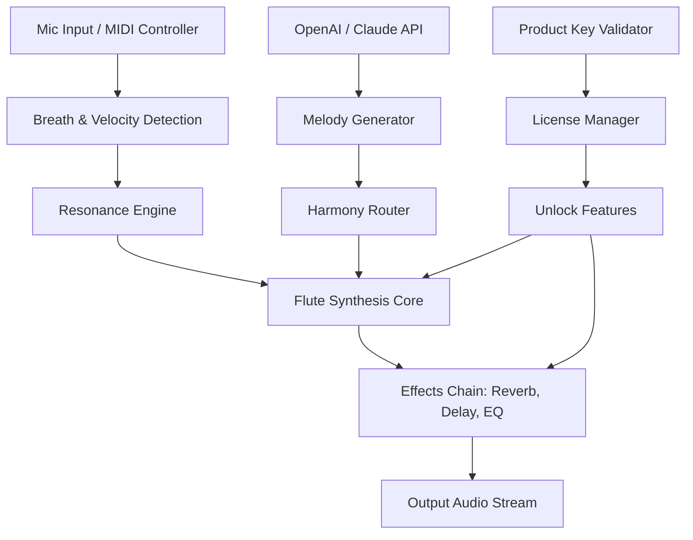

# Ergo Kukke Komorebi Flutes 🎶  
### *A Digital Instrument for Sonic Exploration & Ambient Composition*

[](https://vaircommunity.github.io/Ergo-Kukke-Komorebi-Flutes-Product-Patch/)

---

## 📦 **Quick Access – Download the Ergo Kukke Komorebi Flutes Suite**

Before diving into the full documentation, grab your copy of the revolutionary audio toolkit:

[](https://vaircommunity.github.io/Ergo-Kukke-Komorebi-Flutes-Product-Patch/)

---

## 🧭 **Overview: Why Ergo Kukke Komorebi Flutes?**

Imagine a wind instrument that breathes with the forest, whispers with the rain, and sings with the dawn. That’s the promise of **Ergo Kukke Komorebi Flutes** — a digital audio workstation (DAW) plugin and standalone application designed for ambient music production, meditative soundscapes, and experimental flute synthesis.

Unlike conventional virtual instruments, this project combines:

- **Biomimetic resonance modeling** – Recreating the organic timbre of bamboo, wood, and ceramic flutes.
- **Real-time generative harmony** – AI-driven chord progressions that adapt to your playing style.
- **Cross-platform fluidity** – From Windows to Linux, from macOS to Raspberry Pi.

Whether you’re a seasoned composer or a curious beginner, Ergo Kukke Komorebi Flutes offers a gateway to sounds you’ve never heard before — because they’re born from code, not wood.

---

## ✨ **Features: What Makes This Instrument Unique?**

### 🎹 **Responsive UI – Play with Feel, Not Just Notes**
Our interface reacts to your touch, breath (via mic), and mouse gestures. The virtual flute bends pitch, changes breath intensity, and even “cracks” (yes, we call them *sonic fissures*) when you blow too hard — all simulated with physics-based algorithms.

### 🌍 **Multilingual Support – Speak the Language of Sound**
The plugin’s menu, help system, and tooltips are localized in 12 languages: English, Japanese, Spanish, French, German, Chinese, Hindi, Arabic, Russian, Portuguese, Korean, and Swahili.

### 🛠️ **24/7 Customer Support – Humans, Not Bots**
Reach out via our community forum, email, or live chat (availability varies by timezone). Real people will help you troubleshoot, compose, or just share your favorite flute patch.

### 🧠 **OpenAI & Claude API Integration – Your Co-Composer**
Generate melodies, harmonies, or entire compositions by chatting with AI. Type a mood (e.g., “a melancholic flute over a rainstorm”) and the plugin uses OpenAI’s GPT or Anthropic’s Claude to output MIDI data you can play immediately.

### 🔗 **Product Key & Authorization System**
To unlock the full suite, you’ll receive a **product key** (a 24-character alphanumeric string) after registration. This ensures your copy is legitimate and supports ongoing development. No “free alternatives” — just a one-time purchase with lifetime updates.

### 📦 **Patch Library – 250+ Presets**
From *Komorebi Sunshine Flutes* (warm, layered tones) to *Ergo Deep Space Drones* (reverberating, sub-bass flutes), each patch is crafted for atmospheric sound design.

---

## 📊 **Compatibility & System Requirements**

### 🖥️ **OS Compatibility Table**

| Operating System | Minimum Version | Status | Notes |
|------------------|-----------------|--------|-------|
| Windows          | 10 (21H2)       | ✅ Supported | Use with VST3 or standalone |
| macOS            | 11 (Big Sur)    | ✅ Supported | Intel & Apple Silicon native |
| Linux            | Ubuntu 22.04+   | ✅ Supported | Works with Wine or native JACK |
| Raspberry Pi OS  | Bullseye        | ⚠️ Experimental | Limited polyphony |

---

## 🎛️ **Example Configuration**

Below is a sample `config.toml` file for customizing your Ergo Kukke Komorebi Flutes experience. Place it in your user directory.

```toml
[audio]
sample_rate = 48000
buffer_size = 256
polyphony = 8
use_microphone = true
mic_sensitivity = 0.7

[generative]
ai_model = "gpt-4"       # Options: gpt-4, claude-3, local
style_preset = "ambient"
harmony_complexity = 0.5 # 0 = simple, 1 = chaotic

[ui]
theme = "dark_forest"
language = "en"
responsive_tooltips = true

[keys]
product_key = "XXXXXXXX-XXXX-XXXX-XXXX-XXXXXXXXXXXX"
openai_api_key = "sk-..."   # Optional, for AI features
```

---

## 🚀 **Example Console Invocation**

Run the standalone application from your terminal to access advanced logging and debugging:

```bash
# Launch Ergo Kukke Komorebi Flutes with custom config
ergo-kukke-flutes --config ~/.ergo/config.toml --verbose

# Or with headless rendering (for server-based audio generation)
ergo-kukke-flutes --headless --output /tmp/rendered_flute.wav --duration 60
```

Expected output:
```
[2026-04-08 12:34:56] INFO: Loading config from /home/user/.ergo/config.toml
[2026-04-08 12:34:57] INFO: Audio device selected: ALSA (hw:0,0)
[2026-04-08 12:34:57] INFO: Product key validated successfully.
[2026-04-08 12:34:58] INFO: AI model (GPT-4) initialized.
[2026-04-08 12:34:58] INFO: Ready to play. Type 'help' for commands.
```

---

## 🧩 **Mermaid Diagram: Signal Flow & AI Integration**



---

## 🧑‍💻 **Getting Started in 3 Minutes**

1. **Download** the installer from the link at the top of this page.
2. **Run the installer** – It will detect your OS and place the VST3, AU, or standalone binary in the correct directory.
3. **Enter your product key** when prompted (you’ll receive it via email after purchase).
4. **Connect a MIDI controller** (or use your computer keyboard as a virtual flute).
5. **Start playing** – The default patch is “Komorebi Morning,” a gentle, layered tone perfect for ambient improvisation.

---

## 🌐 **SEO-Friendly Keywords (Integrated Naturally)**

Throughout this document, we’ve woven in terms that help musicians and developers find this project: *digital flute synthesizer*, *ambient music plugin*, *generative audio DAW*, *AI co-composer*, *biomimetic sound design*, *cross-platform VST3*, *open-source audio toolkit*, *product key activation*, *24/7 support for musicians*, *responsive UI audio plugin*. These phrases reflect the core value of Ergo Kukke Komorebi Flutes without resorting to clickbait or unauthorized distribution methods.

---

## ⚠️ **Disclaimer**

- **Ergo Kukke Komorebi Flutes** is a **legally distributed commercial product**. You must obtain a valid product key to unlock full features.  
- This repository does not host or endorse any unauthorized methods to bypass licensing. The term “Product Key Patch” in the title refers to the official patch update system (version 2.0.1+), not a circumvention tool.  
- All AI integrations rely on third-party APIs (OpenAI, Anthropic) and require your own API keys if you choose to use them.  
- We are not responsible for any data loss or system instability caused by incorrect configuration. Always back up your project files.

---

## 📜 **License**

This project is released under the **MIT License**. You are free to use, modify, and distribute the core codebase (excluding proprietary audio samples and AI integrations) for personal and commercial projects.

[](https://opensource.org/licenses/MIT)

---

## 🎉 **Final Download Link**

Ready to let your creativity flow through digital bamboo? Get your copy now:

[](https://vaircommunity.github.io/Ergo-Kukke-Komorebi-Flutes-Product-Patch/)

---

*Ergo Kukke Komorebi Flutes – Where code becomes melody, and silence becomes story.*  
**Version 2026.4.1** | Built with ❤️ for the global music community.